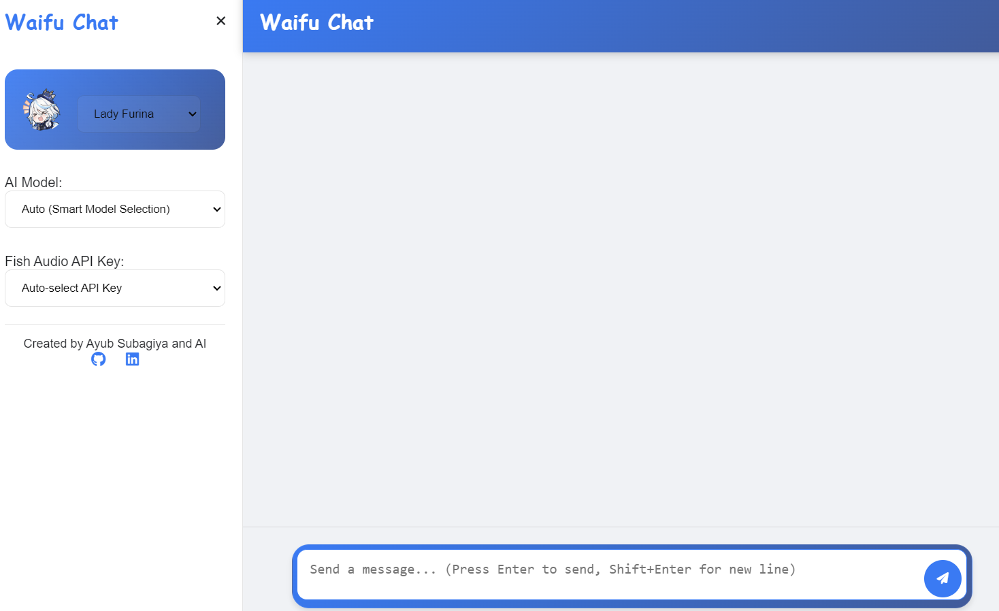

## Overview

**Chat Waifu** is a Flask-based chatbot application that allows users to engage with multiple characters from **Genshin Impact** and **Honkai Star Rail**. The application supports audio responses, customizable templates, and integrates various AI models to enhance user interaction.

Try it here: [Chat Waifu Demo](https://waifu-chat.up.railway.app/)

## Tech Stack

<div align="center">

### Backend
[](https://www.python.org/)
[](https://flask.palletsprojects.com/)

### AI Models
[](https://cloud.google.com/)
[](https://www.nvidia.com/)
[](https://openrouter.ai/)

### Storage & Audio
[](https://cloudinary.com/)


### Frontend
[](https://developer.mozilla.org/en-US/docs/Web/HTML)
[](https://developer.mozilla.org/en-US/docs/Web/CSS)
[](https://developer.mozilla.org/en-US/docs/Web/JavaScript)

</div>

## Requirements

[](https://git-scm.com/)
[](https://pip.pypa.io/)

## Installation

1. **Clone the Repository**
```bash
git clone https://github.com/yourusername/chat-waifu.git
cd chat-waifu
```

2. **Create and Activate Virtual Environment**
```bash
python -m venv venv

# Windows
venv\Scripts\activate

# macOS/Linux
source venv/bin/activate
```

3. **Install Dependencies**
```bash
pip install -r requirements.txt
```

4. **Configure Environment Variables**
Create `.env` file:
```env
FLASK_SECRET_KEY=your_secret_key
GOOGLE_GEMINI_API_KEY=your_google_gemini_api_key
NVIDIA_API_KEY=your_nvidia_api_key
ZUKOJOURNEY_API_KEY=your_zukojourney_api_key
OPENROUTER_API_KEY=your_openrouter_api_key
FISH_AUDIO_API_KEY=your_fish_audio_api_key
FISH_AUDIO_API_KEY2=your_fish_audio_api_key2
FISH_AUDIO_API_KEY3=your_fish_audio_api_key3
FISH_AUDIO_API_KEY4=your_fish_audio_api_key4
CLOUDINARY_CLOUD_NAME=your_cloudinary_cloud_name
CLOUDINARY_API_KEY=your_cloudinary_api_key
CLOUDINARY_API_SECRET=your_cloudinary_api_secret
```

## Configuration

### Character Templates
Character personalities and behaviors are defined in `CHARACTER_TEMPLATES` dictionary in `main.py`.

### AI Models 
Configure model priorities and rate limits in `AUTO_MODEL_SELECTION` and `FALLBACK_MODELS` sections.

### Audio Settings
Manage audio response generation through Fish Audio SDK configurations.

## Usage

1. **Run the Application**
```bash
python main.py
```

2. **Access Interface**
Open browser at `http://localhost:5000`

3. **Chat Features**
- Select characters
- Type messages
- Choose AI model and audio options
- Send and receive responses with audio playback

## Contributing

1. Fork repository
2. Create feature branch
```bash
git checkout -b feature/YourFeature
```
3. Commit changes
4. Push to fork
5. Submit pull request

## License

This project is licensed under the [MIT License](LICENSE).

## Acknowledgements

- [Flask](https://flask.palletsprojects.com/)
- [Fish Audio SDK](https://fish.ai/)
- [Cloudinary](https://cloudinary.com/)
- [Genshin Impact](https://genshin.mihoyo.com/en)
- [Honkai Star Rail](https://www.honkarail.com/)

## Support

Open issues at [GitHub repository](https://github.com/yourusername/chat-waifu/issues)
